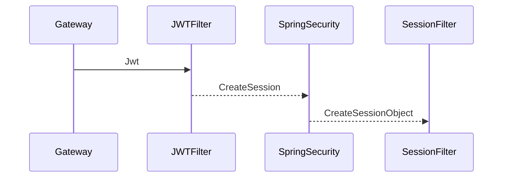

# Oauth2-Client Kütüphanesi

Uygulamaların security ihtiyaçları için tasarlanmış kütüphanedir. Keycloak üzerinden alınan JWT token resourcelarda token validate edilmesini ve Security Context oluşmasını sağlamaktadır.
Validate işlemini Keycloak üzerinden alınan PUBLIC_KEY yardımı ile yapıp STS olmadan self verification yapmaktadır.

## Content

- [Install](#install)

- [Usage](#usage)


## Install

**Maven Dependency :**
 ```js
     <dependency>
        <groupId>com.demo.oauth</groupId>
    <artifactId>oauth2-client</artifactId>
    <version>1.0.0</version>
</dependency>
```
**Properties :**
```
oauth2-client:
  jwt:
    principal-attribute: preferred_username
    public-key: ${JWT_PUBLIC_KEY}
    algorithm: RS256
  resource-id: demo
  permit-urls:
    - "/actuator/*"
    - "/favicon.ico"
    - "/test/*"
    - "/assets"
  selfToken: "eyJhbGciOiJSUzI1NiIsInR5cCIgOiAiSldUIiwia2lkIiA6ICJncnhVZW1taU1uZlRVIn0..."
  cors:
    corsEnabled: true
    allowed-origins: "http://localhost:3000"
```

| Properties                 | Application                                                                                                                                                            |
|----------------------------|------------------------------------------------------------------------------------------------------------------------------------------------------------------------|
| jwt                        | Jwt ayarlamaları defaultta yapılmıştır Ek ayar yapmanıza ihtiyaç yoktur.                                                                                               |
| resource-id                | Keycloak üzerinde kayıtlı olan servis adi                                                                                                                              |
| permitted-urls             | Security ile etkileşime girmeyecek endpoint adresleri. "/**" verilirse tüm endpointler açık .actuator endpoint açık haldedir.                                          |
| cors                       | Gelen URL isteklerin Cors Filter üzerinde izin verilmek için kullanılmaktadır.                                                                                         |
| corsEnable-allowed-origins | Cors Enable edebilirsiniz Defaultta false olarak gelir.Aktif halde iken allowedOriginsleri belirtmeniz gerekiyor.Gateway Cors olduğu için false olarak önerilmektedir. |
| selfToken                  | Local ortamda security sağlamak için AuthServer üzerinden almış olduğunuz JWT token doğrudan kullanabilirsiniz.                                                        |

Sade bir YML şeklinde kullanabilirsiniz.Default özellikler kütüphane üzerinde bulunmaktadır.
```
oauth2-client:
  resource-id: kimlik
  permit-urls:
    - "/vs"
  selfToken: "eyJhbGciOiJSUzI1NiIsInR5cCIgOiAiSldUIiwia2lkIiA6ICJncnhVZW1taU1uZmFuUHIwQ1NXYmlVSmhVTmhqT0doakR3OFZqcWZGclRVIn0..."
```

## Usage

### Self Authentication Kullanımı :
Local ortam dışında kullanılmamalıdır!

Staging ortamından yada Prod ortamından almış olduğunuz token ile işlem yapabilirsiniz. Token OpenIDConnect Postman Collection yardımı  ile JWT alıp SelfToken bölümüne eklediğinizde Local ortamda bir Filter devreye giriyor ve Headerınıza bu token ekleyerek authorization akışına devam etmektedir.


### METHOD SECURITY  & SESSION SERVICE
    private final SessionService sessionService;
    
      @GetMapping("/messages")
      @PreAuthorize("hasAuthority('YETKI_DUZENLE')")
      public String getMessages() { 
         System.out.println(sessionService.getSessionInfo().toString());  
         return sessionService.getSessionInfo().toString();  
      }   

Session Bilgilerine  sessionService.getSessionInfo() ile erişebilirsiniz
Security Yetki kontrolü için   @PreAuthorize("hasAuthority('YETKI_DUZENLE')") deyimi kullanılacaktır.

### LOG  işleminde Session 
Session bilgisi log dosyalarında otomatik MDC Filter yardımıyla eklenmektedir.
```
log.info("Yetki");
```
Context SessionInfo şeklinde oluşmaktadır:

``` json
{
"@timestamp":"2023-12-06T17:10:07.159921407+03:00",
"message":"Yetki",
"logger_name":"com.demo.service.impl.PermissionServiceImpl",
"level":"INFO",
"context":{"SESSION_INFO":"{adi='Ömer Faruk', soyadi='İÇEN', kullaniciAdi='demo'}"},
"application_name":"mkys",
"trace":{"caller_class_name":"com.demo.service.impl.Permission",
  "caller_method_name":"searchPermission","caller_file_name":"PermissionImpl.java",
  "caller_line_number":48
  }}
```

### Uygulamada Security Dışında tutmak

 PermitURL verip SelfToken Silmeniz gerekiyor.
``` yml
 permitted-urls:
    - "/**"
    - "/*"
    - "/***"
    - "/*/*"
``` 
! Methodların üzerinde @PreAuthorize Annotationları varsa hepsini devre dışı bırakmak için
@EnableMethodSecurity(jsr250Enabled = true, prePostEnabled = true) annotaion uygulamanızdan kaldırmanız gerekiyor

## UML diagrams




```mermaid

```

## UML Test diagrams

```mermaid
sequenceDiagram
FE ->> SecureLocalFilter: Jwt
SecureLocalFilter-->>SpringSecurity: BearerTokenFilter
SpringSecurity-->>SessionFilter: CreateSessionObject


```


```mermaid

```

